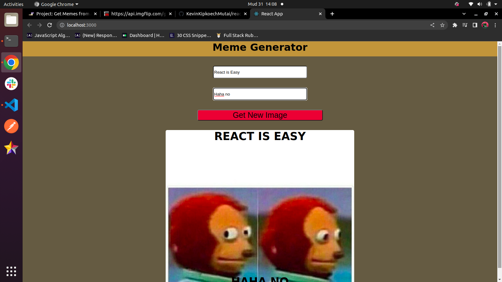

# Meme Generator

This is a simple react application that allows a user to select a random image from an API and create a meme by typing text into a form.

Its use is simply straightforward. Just follow the link in the about section and enjoy!

For local use, clone this repository and open the terminal in VSCode. Run 'npm install' then 'npm start' to get started.

